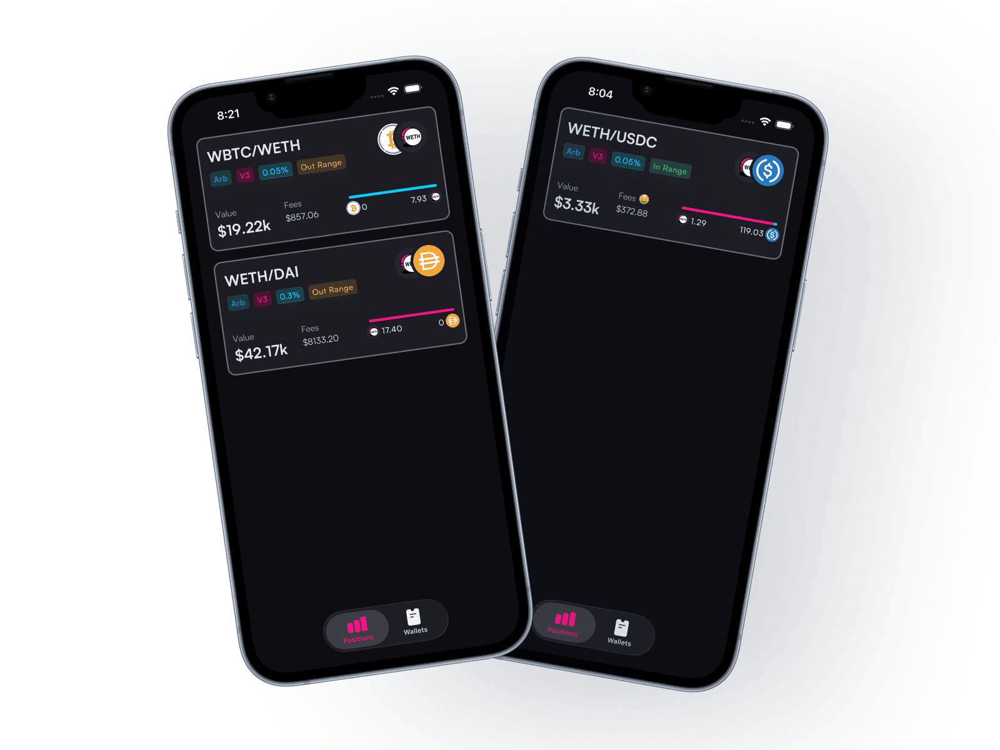

A modular data platform for querying, indexing, and analyzing on-chain positions across multiple networks.
 
Monitor your LP positions — see your liquidity, track accumulated fees, and get a clear picture of your DeFi portfolio in one place.
